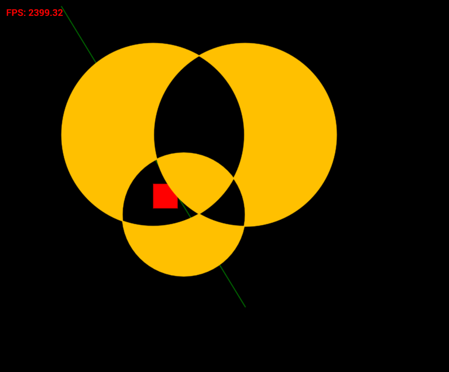
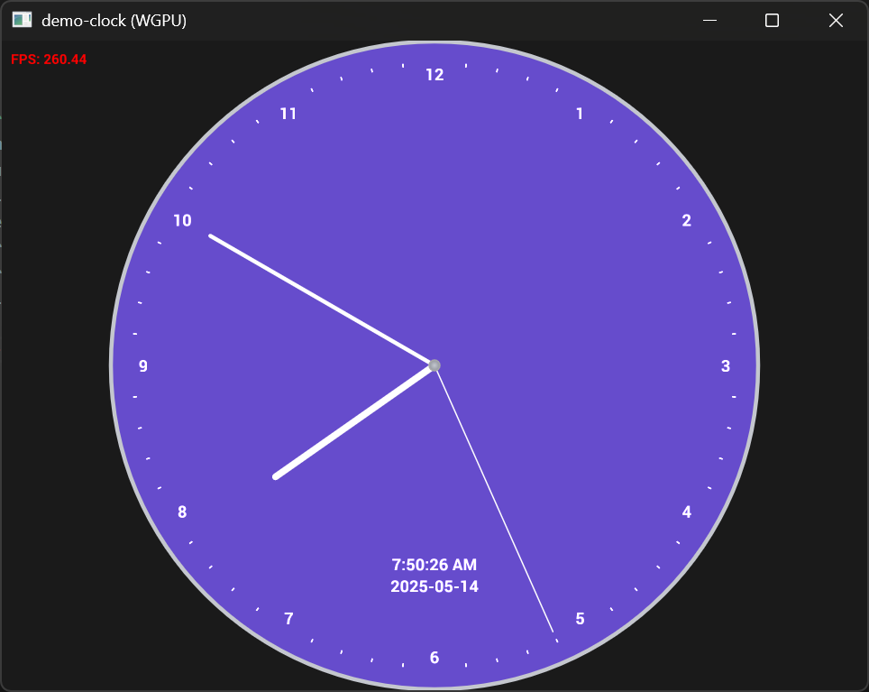
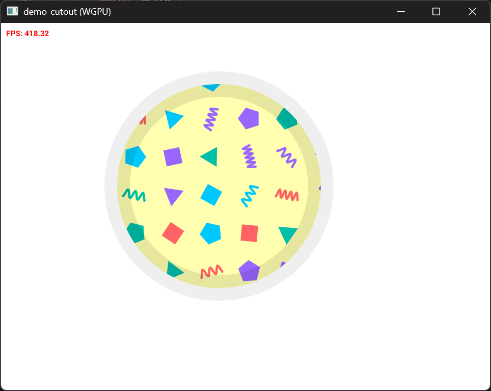
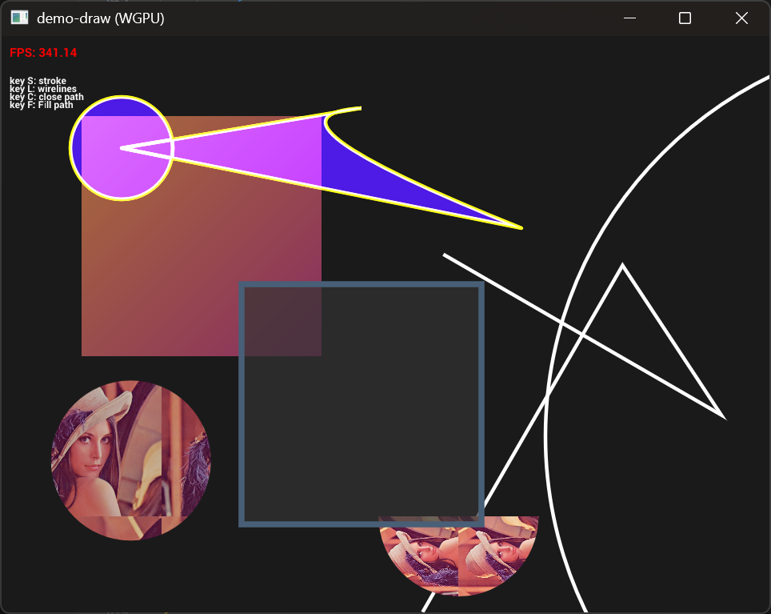

# Pure-rust implementation of NanoVG

## TODO List

- [x] 修复抗锯齿BUG(PathCache抗锯齿边缘区域被错误的重复绘制多次)
- [x] fringe_widthg固定位1像素，才能在在4K屏幕上拥有更好的显示效果
- [x] 修复Clock DEMO的锯齿显示问题(错误的Blend Mode)
- [x] 修复Cutout DEMO的错误显示问题(绘制字体时错误的ctx状态切换)
- [x] 支持常规的winding模式和奇偶模式
- [x] 支持Framebuffer(OpenGL Mode)
- [x] 支持wireframe(PolygonMode为LINE)的`wireframe`features(用于调试)
- [x] 原生单像素方式(OpenGL LINE_STRIP)的`wirelines`features，低开销占用或者CAD场景使用
- [x] 支持独立的Path对象，不是每次都重新将绘图命令进行路径细分，降低CPU占用
- [ ] 曲线对齐的字体布局
- [ ] 支持dot dash虚线绘制（Paint PathEffect）
- [ ] FBO MSAA支持，渲染到屏幕还不支持MSAA
- [ ] 支持[lyon](https://docs.rs/lyon/latest/lyon/)的接口进行图形绘制，支持跟复杂的细分算法，不支持抗锯齿，与[NanovgXC](https://github.com/styluslabs/nanovgXC)的抗锯齿方式肯能会有很好的兼容？
- [ ] 复杂的填充算法，例如stroke随路径长度的色彩渐变
- [ ] 支持WGPU
- [ ] 支持NanovgXC方式的渲染算法


## Demos

<table>

<tr><td><h3>Simple square</h3>

```
cargo run -p nvg-gl --example demo-square
```

The tiniest way to use nvg+glutin, can help beginner to start with nvg.

</td><td>

</td></tr>

<tr><td><h3>Clock</h3>

```
cargo run -p nvg-gl --example demo-clock
```

</td><td>

</td></tr>

<tr><td><h3>Cutout</h3>

```
cargo run -p nvg-gl --example demo-cutout
```

</td><td>
  
</td></tr>

<tr><td><h3>Draw</h3>

```
cargo run -p nvg-gl --example demo-draw
```

</td><td>
  
</td></tr>
</table>
