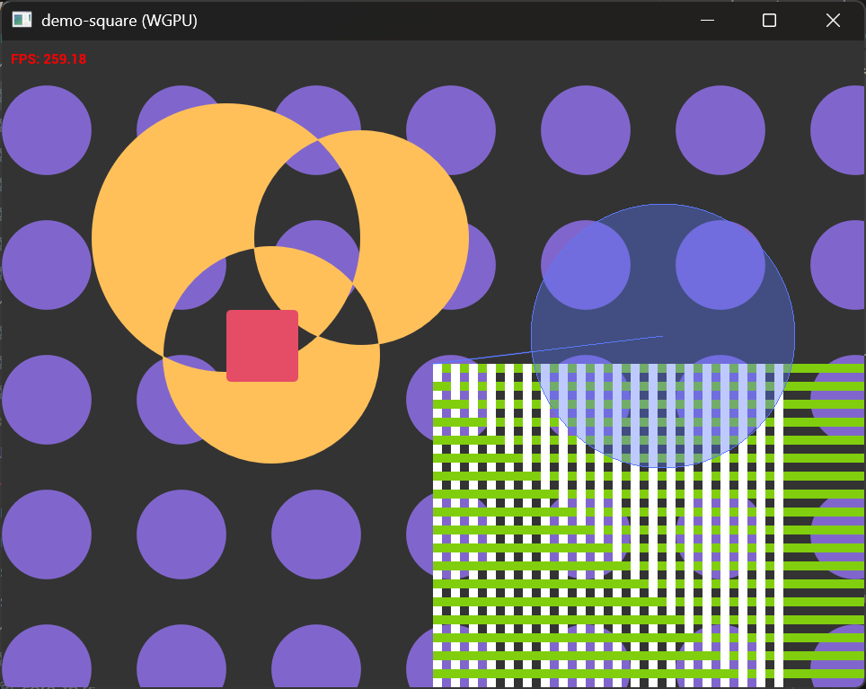

# NVGX: Pure-rust NanoVG

nvgx是[NanoVG](https://github.com/memononen/nanovg)的纯Rust实现和升级版本，而不是进行单纯的C API封装。相比于[nvg](https://github.com/sunli829/nvg)，提供了更完善的API功能支持和性能优化，例如`FrameBuffer`和`Instanced Path`绘制模式。并且为`WGPU Backend`提供了支持 
* `Framebuffer` Support
* `Path` and `Instanced API` Support
* `WGPU backend` Support

> NanoVG is small antialiased vector graphics rendering library for OpenGL. It has lean API modeled after HTML5 canvas API. It is aimed to be a practical and fun toolset for building scalable user interfaces and visualizations.
### Note
> OpenGL Backend API目前不再是OpenGL3而是OpenGL4，OpenGL4 已经发布15年市面上绝大多数的GPU都已经支持，并且OpenGL开始逐渐被Vulkan被替代。

## TODO List

- [x] 修复抗锯齿BUG(PathCache抗锯齿边缘区域被错误的重复绘制多次)
- [x] fringe_widthg固定位1像素，才能在在4K屏幕上拥有更好的显示效果
- [x] 修复Clock DEMO的锯齿显示问题(错误的Blend Mode)
- [x] 修复Cutout DEMO的错误显示问题(绘制字体时错误的ctx状态切换)
- [x] 支持常规的winding模式和奇偶模式
- [x] 支持Framebuffer(OpenGL Mode)
- [x] 原生单像素方式(OpenGL LINE_STRIP)的`wirelines`features
- [x] 支持独立的Path对象，不是每次都重新将绘图命令进行路径细分，降低CPU占用
- [x] 修复arc_to的bug
- [x] 支持WGPU
- [ ] 支持dot dash虚线绘制（PathEffect）
- [ ] 支持阴影和模糊效果 (ImageEffect)
- [ ] 支持超过2点的渐变
- [ ] 支持[lyon](https://docs.rs/lyon/latest/lyon/)的接口进行图形绘制，支持跟复杂的细分算法，不支持抗锯齿，与[NanovgXC](https://github.com/styluslabs/nanovgXC)的抗锯齿方式肯能会有很好的兼容？
- [ ] ~~FBO MSAA支持，渲染到屏幕还不支持MSAA~~
- [ ] ~~支持NanovgXC方式的渲染算法，支持将文本作为Path渲染，曲线对齐的字体布局~~


## Usage

* Reference example [nvgx/nvgx-demo/Cargo.toml](https://github.com/rede97/nvgx/blob/master/nvgx-demo/Cargo.toml) 

```toml
[dependencies]
nvgx = "0.2.0"
# Use wgpu backend
nvgx-wgpu = "0.1.0"
# Use OpenGL 4.2 backend
nvgx-ogl = "0.1.0"
```

## Demos
```
git clone https://github.com/rede97/nvgx
cd nvgx
```

<table>

<tr><td><h3>Simple and Framebuffer</h3>
The tiniest way to use nvgx and framebuffer, can help beginner to start with nvgx.

```
cargo run -p nvgx-demo --example demo-square
```
Use WGPU backend by default
```
cargo run -p nvgx-demo --example demo-square --features "nvgx-demo/ogl"
```
Use OpenGL backend

</td><td>

</td></tr>

<tr><td><h3>Clock</h3>

```
cargo run -p nvgx-demo --example demo-clock
```

</td><td>

</td></tr>

<tr><td><h3>Cutout</h3>

```
cargo run -p nvgx-demo --example demo-cutout
```
Use canvas api to draw cutout

```
cargo run -p nvgx-demo --example demo-inst
```
Use Path and instanced API to draw cutout

</td><td>
  
</td></tr>

<tr><td><h3>Draw</h3>

```
cargo run -p nvgx-demo --example demo-draw
```

</td><td>
  
</td></tr>
<tr><td><h3>Bezier and ArcTo</h3>

```
cargo run -p nvgx-demo --example demo-bezier
```

</td><td>
  
</td></tr>
</table>
